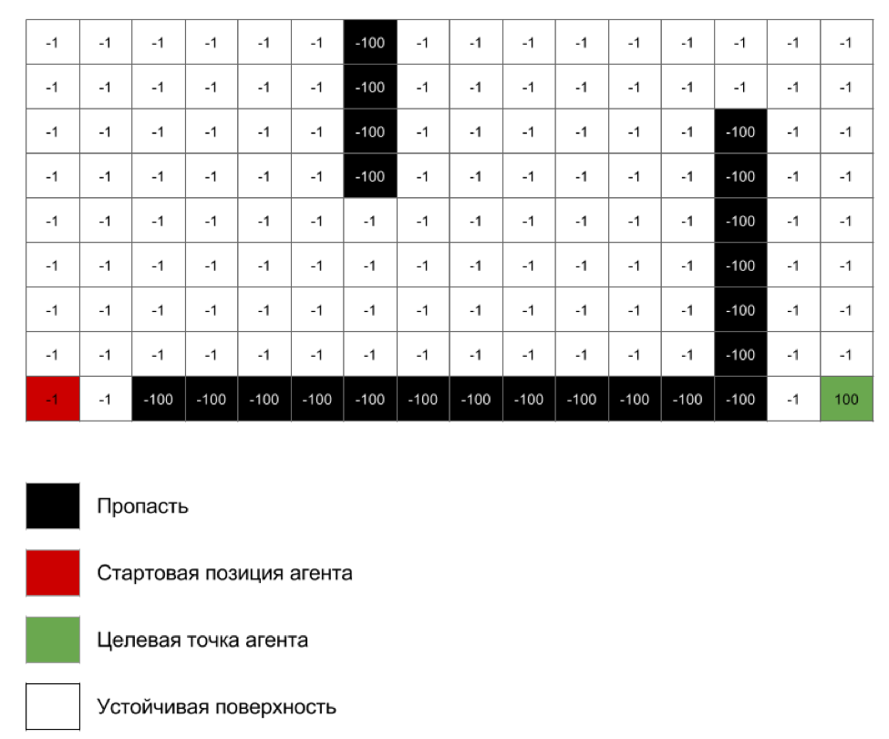
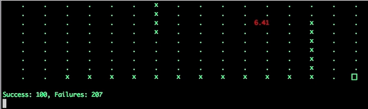
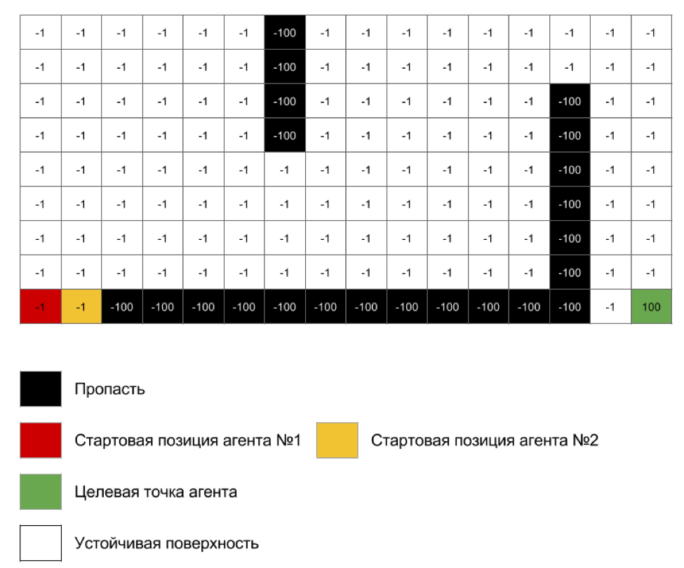
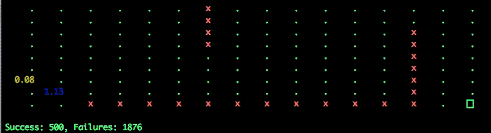

# Q-Learning

## 5th rooms problem

See description [here](http://mnemstudio.org/path-finding-q-learning-tutorial.htm)

## Single Agent

#### Task

#### Result

## Multu Agent

#### Task

#### Result

## Installation

$ sudo -H pip install -r requirements.txt

$ sudo apt-get install tcl-dev tk-dev python-tk python3-tk